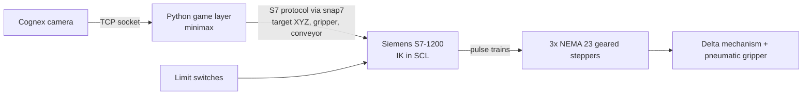

# Delta Robot: Vision-Guided Parallel Manipulator

A three-axis delta robot designed, machined, and programmed from scratch. A Cognex camera on the end effector reads a tic-tac-toe board, a Python game layer chooses the move, and a Siemens S7-1200 PLC executes it through closed-form inverse kinematics. The result is an autonomous robot that plays tic-tac-toe against a human.

Delta Tec Challenge, *Design and Development of Robots*, Tecnológico de Monterrey, February to June 2025. Team of six.

<!-- Replace with a photo or GIF of the physical robot playing -->
<!--  -->

## System overview

Perception and decision making run on a PC; everything that touches the motors (kinematics, homing, motion commands) runs deterministically on the PLC. The PC only writes a Cartesian target and a few flags to a PLC data block.

## Mechanical design

Designed in SolidWorks and manufactured in-house on a Haas VF-4 CNC mill and a lathe.

| Subsystem | Implementation |
|---|---|
| Structure | Base, biceps, motor mounts, and end-effector platform CNC-cut from 1/2 in aluminum plate |
| Actuation | NEMA 23 steppers (3 N·m) with SPLF60 5:1 planetary gearboxes, one per arm |
| Shoulder joint | Oldham coupling into a lathe-turned aluminum shaft supported by an SHF-14 crossed-roller bearing, which carries the arm's moment loads instead of the gearbox |
| Forearms | Parallel pairs of 10 mm aluminum rods with left- and right-hand threaded M6 rod ends, so each forearm's length can be trimmed by rotating the rod |
| End effector | Pneumatic gripper and Cognex camera mounted on the moving platform |
| Safety and sensing | Roller-lever limit switch per arm for homing, emergency stop, thermomagnetic breaker |

With 1/16 microstepping and the 5:1 gearbox, each arm has 16,000 steps per revolution, a joint resolution of 0.0225°.

A static FEA of the full assembly (551 contact sets) under a 2 kg payload gave a maximum resultant displacement of about 0.12 mm.

## Kinematics

| Parameter | Value |
|---|---|
| Base radius (center to biceps axis), $\rho_B$ | 215.8 mm |
| Biceps length, $l_1$ | 320 mm |
| Forearm length (rod-end center to center), $l_2$ | 476 mm |
| Platform radius, $\rho_P$ | 100 mm |

**Inverse kinematics** is solved in closed form, arm by arm. For arm *i*, the target platform joint is rotated into that arm's plane (0°, 120°, 240° about *z*). The forearm, a sphere of radius $l_2$ around the platform joint, cuts that plane in a circle of radius

$$\phi_i = \sqrt{l_2^2 - x_i^2}$$

where $x_i$ is the out-of-plane offset. The elbow is the intersection of this circle with the biceps circle of radius $l_1$ around the shoulder, and

$$\theta_i = \operatorname{atan2}\left(z_{J_i},\; y_{B_i} - y_{J_i}\right)$$

taking the outward elbow configuration. Targets where the circles do not intersect are rejected as unreachable.

**Forward kinematics** shifts each elbow inward by $\rho_P$, which collapses the platform to a point, and solves for the platform center as the intersection of three spheres of radius $l_2$, keeping the solution below the base.

Both models were written in MATLAB and cross-checked as exact inverses of each other. The IK was then ported to Structured Text (SCL) on the PLC, including the helper routines it needs (matrix-vector products, circle intersection, `atan2`), since the S7-1200 has no linear algebra library.

**Workspace.** Sweeping a Cartesian grid and keeping the points where all three arms have a real IK solution maps the reachable volume as a point cloud, and gives the usable radius at each working height, which is what fixes the height of the board and the token feed.

<!-- Run kinematics/DeltaRobotWorkspace.m and save the figure here -->
<!--  -->

## Control and autonomy

- **PLC (S7-1200, TIA Portal):** a main routine dispatches between `HOMING` and `MOVE_XYZ`. Homing jogs each arm to its limit switch and latches a known joint state. `MOVE_XYZ` runs the IK, converts the joint-angle change into relative step counts, and commands the three axes through PLCopen motion blocks (`MC_Power`, `MC_MoveRelative`).
- **PC link:** Python writes targets and flags directly into the PLC data block with `python-snap7`.
- **Vision:** the Cognex job classifies each of the nine cells and sends the result over a TCP socket.
- **Decision:** exhaustive minimax, so the robot never loses.
- **Task sequencing:** approach at a safe height, descend, grip, lift, place, return home. A conveyor feeds new tokens between turns, and a cell occupied by the opponent can be cleared before placing.

## Repository

| Path | Contents |
|---|---|
| `kinematics/` | MATLAB forward and inverse kinematics and the workspace map, with 3D visualization |
| `plc/` | Structured Text blocks running on the S7-1200: inverse kinematics, homing, axis motion |
| `pc/` | Python vision client, PLC link, and the minimax game layer |
| `cad/Subassem/` | Full delta assembly and its subassemblies (base, forearm, end effector, drive) |
| `cad/Aluminum Parts/` | Machined structural parts |
| `cad/Mechanical Elements/` | Purchased components: motor, bearings, couplings, limit switch, camera, gripper |
| `cad/NEMA_23_smart/`, `cad/M6_rod_end/` | Vendor models of the motor-gearbox unit and rod ends |
| `cad/Manufacturing/CNC/` | Part versions prepared for machining |
| `cad/Simulation/` | Static FEA study |
| `docs/` | Figures used in this README |

`plc/` and `pc/` hold the team's control code, mirrored from [VicmanGT/delta-robot](https://github.com/VicmanGT/delta-robot) so the repository is self-contained. Each has its own README describing the blocks and modules.

## Team and my role

Carolina Ruiz Alonso, Marco Adrián Rodríguez Gutiérrez, Luis Ignacio Ramírez Godínez, Emiliano Rafael Rentería Flores, Luis Ricardo Vázquez Fernández, Víctor Manuel Gil Tafolla.

<!-- Confirm and edit -->
My contributions: mechanical design, part manufacturing, and the kinematic model (MATLAB), including the IK formulation later implemented on the PLC. Integration and testing were done jointly with the team.

## Limitations and next steps

- Motion is point to point with fixed delays on the PC side. A trajectory generator with synchronized axes and completion handshakes would raise speed and reliability.
- Positioning is open loop from homing, and board coordinates were tuned by hand. Kinematic calibration (identifying link lengths and joint offsets from measured poses) is the natural next step.
