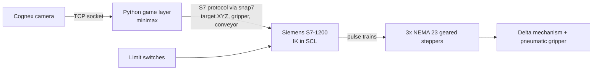
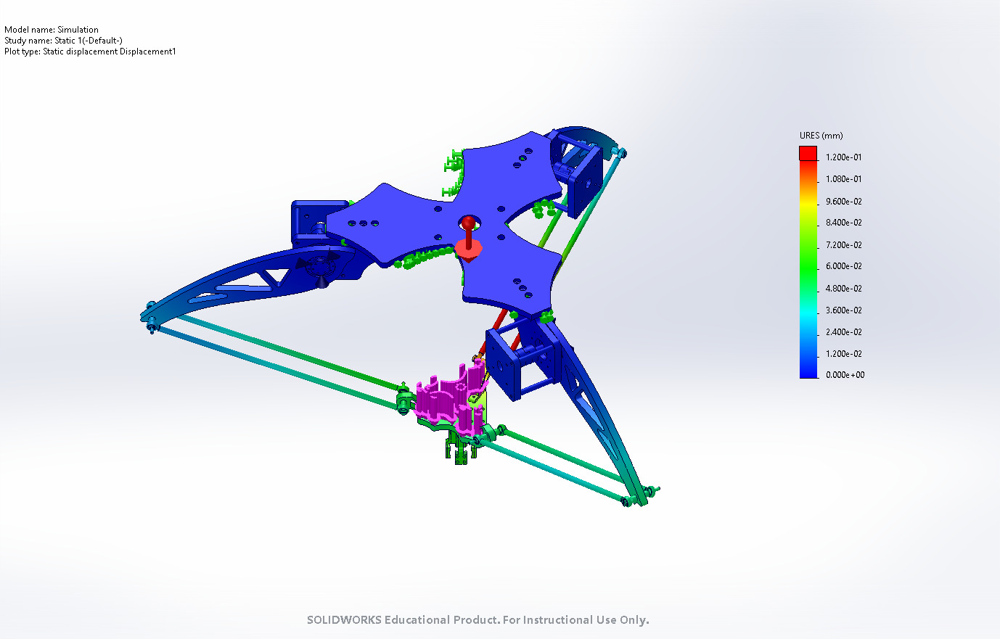
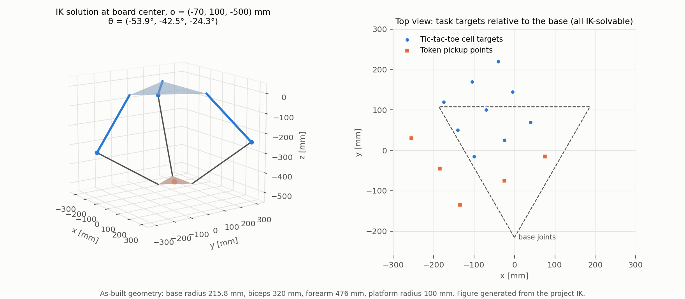
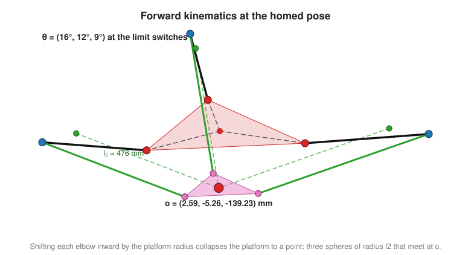
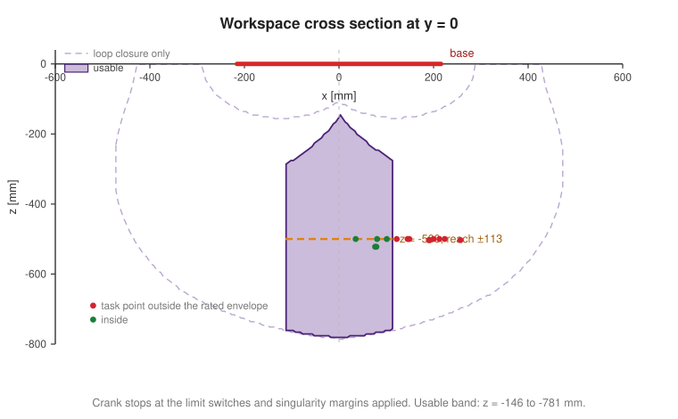
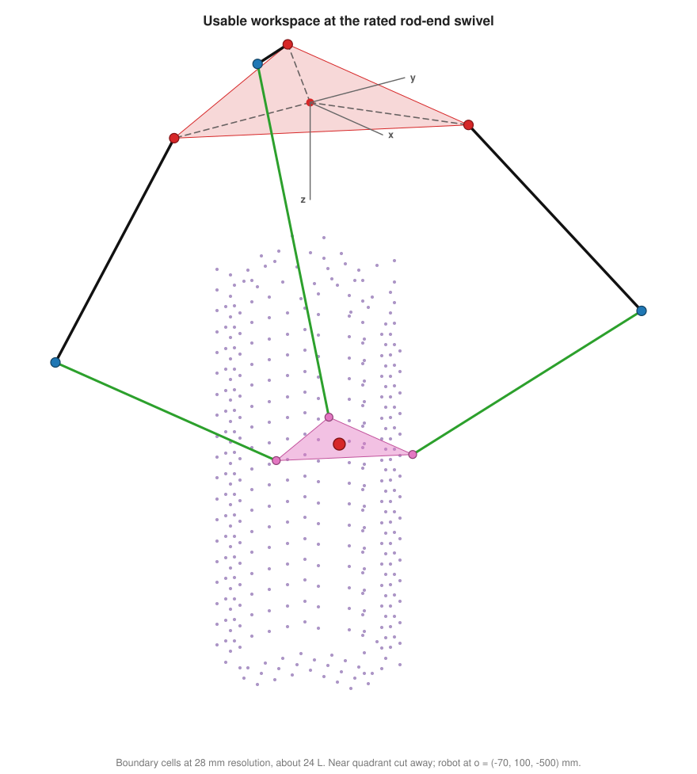

# Delta Robot: Vision-Guided Parallel Manipulator

A three-axis delta robot designed, machined, and programmed from scratch. A Cognex camera on the end effector reads a tic-tac-toe board, a Python game layer chooses the move, and a Siemens S7-1200 PLC executes it through closed-form inverse kinematics. The result is an autonomous robot that plays tic-tac-toe against a human.

Delta Tec Challenge, *Design and Development of Robots*, Tecnológico de Monterrey, February to June 2025. Team of six.

<!-- Replace with a photo or GIF of the physical robot playing -->
<!--  -->

## System overview

Perception and decision making run on a PC; everything that touches the motors (kinematics, homing, motion commands) runs deterministically on the PLC. The PC only writes a Cartesian target and a few flags to a PLC data block.

## Mechanical design

Designed in SolidWorks and manufactured in-house on a Haas VF-4 CNC mill and a lathe.

| Subsystem | Implementation |
|---|---|
| Structure | Base, biceps, motor mounts, and end-effector platform CNC-cut from 1/2 in aluminum plate |
| Actuation | NEMA 23 steppers (3 N·m) with SPLF60 5:1 planetary gearboxes, one per arm |
| Shoulder joint | Oldham coupling into a lathe-turned aluminum shaft supported by an SHF-14 crossed-roller bearing, which carries the arm's moment loads instead of the gearbox |
| Forearms | Parallel pairs of 10 mm aluminum rods with left- and right-hand threaded M6 rod ends, so each forearm's length can be trimmed by rotating the rod |
| End effector | Pneumatic gripper and Cognex camera mounted on the moving platform |
| Safety and sensing | Roller-lever limit switch per arm for homing, emergency stop, thermomagnetic breaker |

With 1/16 microstepping and the 5:1 gearbox, each arm has 16,000 steps per revolution, a joint resolution of 0.0225°.

A static FEA of the full assembly (551 contact sets) under a 2 kg payload gave a maximum resultant displacement of about 0.12 mm.

## Kinematics

| Parameter | Value |
|---|---|
| Base radius (center to biceps axis), $\rho_B$ | 215.8 mm |
| Biceps length, $l_1$ | 320 mm |
| Forearm length (rod-end center to center), $l_2$ | 476 mm |
| Platform radius, $\rho_P$ | 100 mm |

Three MATLAB models in `kinematics/`, each a runnable script that prints its result and draws the robot: `DeltaRobotInvKinematics.m`, `DeltaRobotFwdKinematics.m` and `DeltaRobotWorkspace.m`.

### Inverse kinematics

Solved in closed form, arm by arm, which is what makes it portable to a PLC scan. For arm *i*, the target platform joint is rotated into that arm's plane (0°, 120°, 240° about *z*). The forearm, a sphere of radius $l_2$ around the platform joint, cuts that plane in a circle of radius

$$\phi_i = \sqrt{l_2^2 - x_i^2}$$

where $x_i$ is the out-of-plane offset. The elbow is the intersection of this circle with the biceps circle of radius $l_1$ around the shoulder, and the crank angle follows from the elbow position:

$$\theta_i = \mathrm{atan2}\left(z_{J_i}, y_{B_i} - y_{J_i}\right)$$

Two intersections exist; the one with the smallest $y$ is the outward elbow the machine is built in. Targets where the circles do not intersect are rejected as unreachable, which is the same test the workspace sweep below is built on.

### Forward kinematics

The inverse problem: given the three crank angles, where is the platform? Shifting each elbow inward by $\rho_P$ collapses the moving platform to a single point, so the three forearms become three spheres of radius $l_2$ that intersect at the platform center. Of the two intersections, the one below the base is the physical one.

This is what fixes the reference for the whole open-loop chain: homing jogs each arm onto its limit switch, and the forward kinematics of the three switch angles gives the Cartesian home the PLC latches.

### Workspace

`DeltaRobotWorkspace.m` sweeps a Cartesian grid and keeps the points the robot can actually be commanded to. Solving the loop closure is only the first of four tests, and on its own it is badly optimistic:

1. **Loop closure.** The forearm sphere must reach the arm plane, and the circle it leaves there must cut the biceps circle. This is the IK test above.
2. **Crank stops.** Homing raises each arm until it trips its limit switch, so those angles are the hard upper stop: no pose may ask an arm past 16°, 12° or 9°. Closure alone happily returns poses needing +74° on arm 2, with the biceps hanging straight down and the forearm reaching back up over it.
3. **Rod-end swivel.** Each forearm leaves its arm plane by $\beta_i = \arcsin(x_i / l_2)$, and that angle is misalignment the rod ends at both of its ends have to absorb.
4. **Serial singularity.** Biceps and forearm lined up in the arm plane, at the edge of reach, where the arm gains no velocity along the forearm.
5. **Parallel singularity.** The three forearms approaching a common plane. Their unit vectors are the rows of the platform Jacobian, so the determinant collapsing means the platform loses its stiffness and the rods take the load instead of the cranks.

Each test is a large cut. Loop closure alone claims **425 L** and lets the platform climb to *z* = -20 mm out at the rim. Adding the crank stops and the two singularity margins brings it to **218 L**. Adding the rod ends at their catalogue ±14° leaves **24 L**: a column of radius 125 mm running from *z* = -146 mm down to *z* = -781 mm.

### What this says about the machine

The points in the cross section are the positions the robot actually worked at, and most of them are outside that rated column. The center of the board asks for 14.8° of rod-end misalignment, the far corners 24° to 26°, and the outermost token in the feed 32.4°, well over double the catalogue figure. The robot played whole games from those positions, so the joints were running far past their rated misalignment rather than the poses being impossible.

That is the most useful thing the sweep turned up. The board and the token feed were positioned by hand, on the bench, without checking them against a workspace model, and the model says they should have been kept inside a 125 mm radius of the base axis. Kinematic calibration is the usual next step for a machine like this; on this one, sizing the task to the joints comes first.

The limits all sit at the top of `DeltaRobotWorkspace.m` as `theta_max`, `beta_max`, `det_min` and `ser_min`. Setting the first two to `Inf` and the margins to zero gives the geometric envelope back, which is a useful check but not a place to send the robot.

Both kinematic models were cross-checked as exact inverses of each other. The IK was then ported to Structured Text (SCL) on the PLC, including the helper routines it needs (matrix-vector products, circle intersection, `atan2`), since the S7-1200 has no linear algebra library.

## Control and autonomy

- **PLC (S7-1200, TIA Portal):** a main routine dispatches between `HOMING` and `MOVE_XYZ`. Homing jogs each arm to its limit switch and latches a known joint state. `MOVE_XYZ` runs the IK, converts the joint-angle change into relative step counts, and commands the three axes through PLCopen motion blocks (`MC_Power`, `MC_MoveRelative`).
- **PC link:** Python writes targets and flags directly into the PLC data block with `python-snap7`.
- **Vision:** the Cognex job classifies each of the nine cells and sends the result over a TCP socket.
- **Decision:** exhaustive minimax, so the robot never loses.
- **Task sequencing:** approach at a safe height, descend, grip, lift, place, return home. A conveyor feeds new tokens between turns, and a cell occupied by the opponent can be cleared before placing.

## Repository

| Path | Contents |
|---|---|
| `kinematics/` | MATLAB forward and inverse kinematics and the workspace map, with 3D visualization |
| `plc/` | Structured Text blocks running on the S7-1200: inverse kinematics, homing, axis motion |
| `pc/` | Python vision client, PLC link, and the minimax game layer |
| `cad/Subassem/` | Full delta assembly and its subassemblies (base, forearm, end effector, drive) |
| `cad/Aluminum Parts/` | Machined structural parts |
| `cad/Mechanical Elements/` | Purchased components: motor, bearings, couplings, limit switch, camera, gripper |
| `cad/NEMA_23_smart/`, `cad/M6_rod_end/` | Vendor models of the motor-gearbox unit and rod ends |
| `cad/Manufacturing/CNC/` | Part versions prepared for machining |
| `cad/Simulation/` | Static FEA study |
| `docs/` | Figures used in this README |

`plc/` and `pc/` each have their own README describing the blocks and modules they contain.

## Team and my role

| Member | GitHub |
|---|---|
| Carolina Ruiz Alonso | |
| Emiliano Rafael Rentería Flores | [@erenteriaf](https://github.com/erenteriaf) |
| Luis Ignacio Ramírez Godínez | |
| Luis Ricardo Vázquez Fernández | |
| Marco Adrián Rodríguez Gutiérrez | |
| Víctor Manuel Gil Tafolla | [@VicmanGT](https://github.com/VicmanGT) |

<!-- Confirm and edit -->
My contributions: mechanical design, part manufacturing, and the kinematic model (MATLAB), including the IK formulation later implemented on the PLC. Integration and testing were done jointly with the team.
